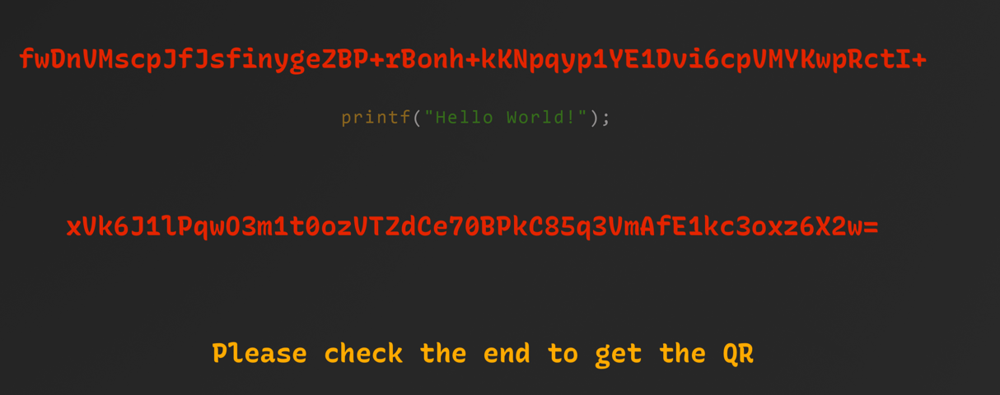
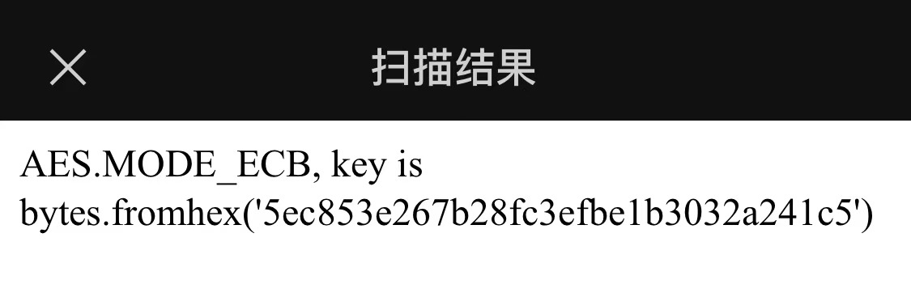

## BrokenPNG
##### 罗承煜 523031910624

### 题目组成
题干：“Help! A Hacker Encrypted My Image!”
文件：broken.png(无法正常打开)，xor.py

### 题目分析
由引言可见，这张打不开的png文件是被加密了，查看xor.py的内容
```
import random

with open("secret.png", "rb") as f:
    data = f.read()

# 16字节
key = random.randbytes(16)

new_data = []

for i in range(len(data)):
    new_data.append(data[i] ^ key[i % len(key)])
with open("broken.png", "wb") as f:
    f.write(bytes(new_data))
```
```key = random.randbytes(16)```:生成一个随机的16位密钥
```new_data.append(data[i] ^ key[i % len(key)])```:
    将原二进制文件的每一位与key的每一位做异或，存进new_data中
    key只有16字节，但key[i % len(key)]使得key每用完一轮都能重头再来
    所以理论上来说只要知道了密钥，就能对整个二进制文件进行复原
    异或操作是可逆的，如果A^B=C,那么A=B^C，所以只要知道16位二进制文件原本应该是多少，就能逆向推出key
    该二进制文件原本是png，png有固定的开头和结束标志，其中开头标志：
    ```89 50 4E 47 0D 0A 1A 0A```只有八字节，不足以还原整个16位的key，现在有两种方法
        1、png的结尾标致```00 00 00 00 49 45 4E 44 AE 42 60 82```,可以一起用于解出所有的key
        2、开头8至16位是IHDR块开头的长度和类型部分，所以一定是00 00 00 0D 49 48 44 52，也可以依次解出所有的key

##### 编写脚本(选择方法2)
```
import os

# 已知PNG文件头
PNG_HEADER = bytes([0x89, 0x50, 0x4E, 0x47, 0x0D, 0x0A, 0x1A, 0x0A, 0x00 , 0x00 , 0x00 , 0x0D , 0x49 , 0x48 , 0x44 , 0x52])

def recover_key(encrypted_data):
    """从加密数据中恢复密钥"""
    key = bytearray(16)
    
    # 使用已知的PNG文件头恢复密钥的前8个字节
    for i in range(min(len(PNG_HEADER), len(encrypted_data))):
        key[i] = encrypted_data[i] ^ PNG_HEADER[i]
    
    # 对于密钥的其余部分，我们需要更多信息或猜测
    # 这里我们假设密钥的其余部分是随机的，但在实际中可能需要更多分析
    # 一个简单的方法是尝试常见的密钥模式或使用统计分析
    
    return bytes(key)

def decrypt_file(encrypted_data, key):
    """使用密钥解密数据"""
    decrypted_data = []
    
    for i in range(len(encrypted_data)):
        decrypted_data.append(encrypted_data[i] ^ key[i % len(key)])
    
    return bytes(decrypted_data)

def main():
    # 读取加密文件
    with open("broken.png", "rb") as f:
        encrypted_data = f.read()
    
    # 恢复密钥
    key = recover_key(encrypted_data)
    print(f"恢复的密钥: {key.hex()}")
    
    # 解密文件
    decrypted_data = decrypt_file(encrypted_data, key)
    
    # 保存解密后的文件
    output_file = "decrypted.png"
    with open(output_file, "wb") as f:
        f.write(decrypted_data)
    
    print(f"已解密文件并保存为: {output_file}")
    
    # 检查解密后的文件是否有效
    if decrypted_data.startswith(PNG_HEADER):
        print("解密后的文件看起来是一个有效的PNG文件")
    else:
        print("解密后的文件可能无效，可能需要更多分析")

if __name__ == "__main__":
    main()
```
得到```decrypted.png```


发现下面有一行没有显示完整，是不是图片高度太少，显示不完全？
用010editor修改图片高度，即可得到完整图片

"please check the end to get the QR"
什么的end?难道是LSB隐写？在最底层藏着一个二维码？（实际上stegsolve根本打不开这个文件，因为高度被我魔改过）
不对，忽然想起解密之后，010editor显示二进制文件最后有一堆aaaaaa，这是干啥的？
仔细检查，发现并不是全a，而是有a有b，这跟QR有什么关系？
难道是像素？a代表白色，b代表黑色，这样能生成张图片，或许是二维码呢？
检查一下，发现最后的aabb一共有20000字，刚好拼成一张200*200的图片，猜测可行。
编写脚本：
```
from PIL import Image
MAX = 200
pic = Image.new("RGB",(MAX, MAX))
s = aa...bb...
str = s.replace('a', '0').replace('b', '1')
i=0
for y in range (0,MAX):
    for x in range (0,MAX):
        if(str[i] == '1'):
            pic.putpixel([x,y],(0, 0, 0))
        else:
            pic.putpixel([x,y],(255,255,255))
        i = i+1
pic.show()
pic.save("QR.png")
```
还真是！

扫码，得到信息

这下我懂了，那串红色的字原来是要这样解码的，怪不得之前丢进cyberchef没反应

编写代码以解码：
```
import base64
from Crypto.Cipher import AES

def pkcs7_unpad(data: bytes) -> bytes:
    """移除PKCS#7填充"""
    padding_length = data[-1]
    if padding_length < 1 or padding_length > 16:
        raise ValueError("无效的填充")
    if data[-padding_length:] != bytes([padding_length]) * padding_length:
        raise ValueError("无效的填充")
    return data[:-padding_length]

# 修改decrypt_aes_ecb函数，增加调试信息
def decrypt_aes_ecb(ciphertext_base64: str, key: bytes) -> str:
    try:
        ciphertext = base64.b64decode(ciphertext_base64)
        cipher = AES.new(key, AES.MODE_ECB)
        plaintext = cipher.decrypt(ciphertext)
        
        # 调试输出
        print(f"解密后字节: {plaintext.hex()}")
        
        # 尝试不同解码方式
        try:
            return plaintext.decode('latin-1')
        except UnicodeDecodeError:
            print("尝试其他解码方式...")
            try:
                return plaintext.decode('latin-1')  # 所有字节都能转为latin-1
            except:
                print("无法解码为字符串，返回原始字节")
                return plaintext
                
    except Exception as e:
        print(f"解密失败: {e}")
        return None

# 示例使用
key = bytes.fromhex('5ec853e267b28fc3efbe1b3032a241c5')  # 16字节密钥
ciphertext_base64 = "fwDnVMscpJfJsfinygeZBP+rBonh+kKNpqyp1YE1Dvi6cpVMYKwpRctI+xVk6J1lPqwO3m1t0ozVTZdCe70BPkC85q3VmAfE1kc3oxz6X2w="

plaintext = decrypt_aes_ecb(ciphertext_base64, key)
if plaintext:
    print(f"明文: {plaintext}")
```
即可得到flag
```MKCTF{Gr4at_J0b_k1ng_of_M1sC_PnNG_Sh@l1_I_Compare_th3e_2_a_summers_d@y}```